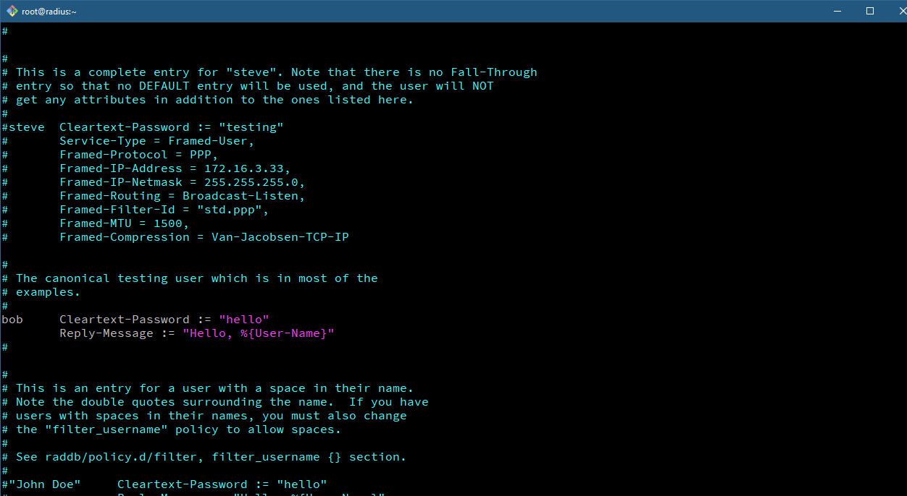
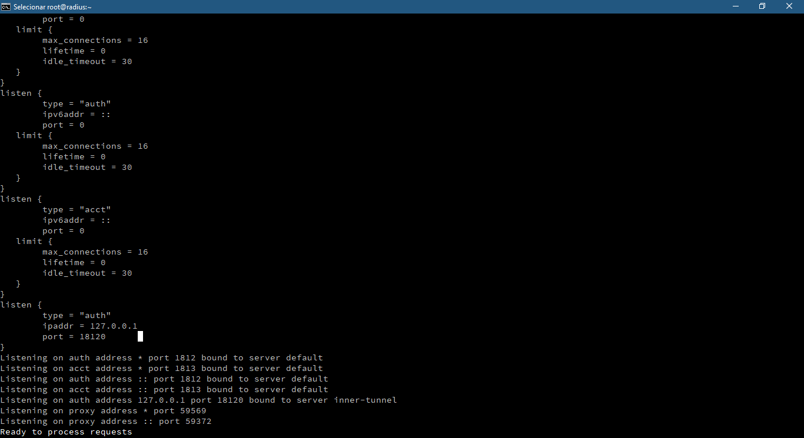

# Servidor freeRADIUS com autenticação LDAP

## Introdução

O presente trabalho irá mostrar como a configurar um servidor RADIUS com autenticação em uma base LDAP.

E para demonstrar o uso faremos o uso de um _hotspot._

### Protocolo RADIUS

O _Remote Authentication Dial In User Service_ \(RADIUS\) é um protocolo que é utilizado para gerenciar o acesso a diversos serviços de rede. O protocolo RADIUS define um padrão para ser utilizado na troca de informações entre um _Network Access Server_ \(NAS\) e um servidor de autenticação, autorização e informações de gerenciamento de contas \(auditoria\), ou também conhecido como servidor de _Authentication, Authorization e Accounting_ \(AAA\).

As principais vantagens na utilização do protocolo RADIUS, dentre uma série de funcionalidades que tornam este tipo de protocolo eficiente, são as seguintes:

* **Segurança**: As transferências de informações entre o cliente \(NAS\) e o servidor RADIUS são autenticadas através de um segredo compartilhado \(_shared secret_\). Este segredo é conhecido previamente, tanto pelo NAS quanto pelo servidor RADIUS e garante a autenticidade do usuário em uma determinada requisição.
* **Compatibilidade**: O servidor RADIUS pode utilizar um banco de dados de usuários de fontes externas para realizar a autenticação dos usuários, como por exemplo, banco de dados _Structured Query Language_ \(SQL\), Kerberos ou LDAP. 

## Instalando o freeRADIUS

Para instalar os servidor RADIUS digite os comandos abaixo:

```text
$ sudo install freeradius freeradius-ldap freeradius-utils
```

Em seguida iremos fazer uma configuração para testarmos se o servidor está funcionando.   
O servidor `RADIUS` oferece um arquivo de usuários, _plain text,_  por padrão a autenticação dos usuários é feita nele.  Vamos abri-lo:

```text
$ sudo vim /etc/raddb/users
```

Em seguida iremos descometar as seguintes linhas:



A linha `bob Cleartext-Password := "hello"` representa a criação de um usuário `bob` com a senha em texto puro `hello` .  
Na linha `Reply-Message := "Hello, %{User-Name}"` indica que quando o usuário for autenticado irá mostrar uma mensagem `Hello` e `%{User-Name}` o nome do usuário.


Inicializando o `freeRADIUS` em modo _debug_:

```text
$ sudo radiusd -X
```



